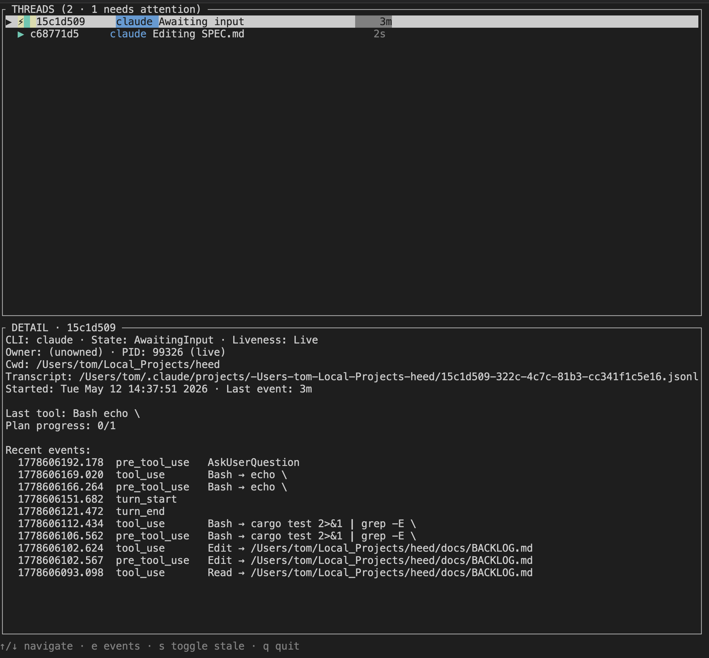

# Heed

A daemon that watches the AI agent sessions running on your machine — Claude Code, Codex, others — and exposes their state as a file that other programs can read.

`heed install` once, and from then on `~/.heed/state.json` contains, for every active session, what it's currently doing (`working`, `awaiting input`, `idle`), what tool it just ran, where its transcript lives, and a few other useful fields. Tools (or other agents) consume that file. Humans get a CLI on top — `heed status`, `heed watch`, `heed tui` — but those are debug surfaces; the file is the contract.

A few things this is useful for:

- An orchestrator wanting to know which of its child agents needs input before routing the user
- An agent that wants to read a sibling agent's transcript path so it can summarise or coordinate
- A status line or tmux bar showing how many sessions are busy
- A notifier that pings you when any session goes to `awaiting input`

## Install

You need Rust ([rustup](https://rustup.rs)).

```sh
cargo install --git https://github.com/nibbletech-labs/heed
heed install
```

Prebuilt binaries appear on [GitHub Releases](https://github.com/nibbletech-labs/heed/releases) once a tag is pushed. A Homebrew tap is planned.

`heed install` writes hook entries into `~/.claude/settings.json` and `~/.codex/config.toml`, drops some shell scripts under `~/.heed/`, and starts a small daemon in the background. Re-running it is safe. To remove everything, `heed install --uninstall`.

On macOS, `heed install --service-install` writes a launchd plist so the daemon comes back at login. When `heed` runs from inside `Heed.app` (macOS 13+), `heed install` instead registers the daemon with macOS as a login item — it shows up as “Heed” under System Settings › Login Items — and `~/.heed/bin/heed` becomes a symlink to the bundle's binary. `heed service status` shows that registration; `heed service unregister` removes it (hooks and `~/.heed` are left alone).

## The state file

`~/.heed/state.json` is the consumption surface. Schema is versioned. Updated within ~100ms of any event. Writes are atomic, so readers never see partial data.

```json
{
  "schema_version": 1,
  "updated_at": 1778605400.5,
  "threads": {
    "claude:ce4f-...": {
      "cli": "claude",
      "activity": "awaiting_input",
      "liveness": "live",
      "subtitle": "Picking 3 options",
      "transcript_path": "/Users/.../<uuid>.jsonl",
      "cwd": "/Users/.../some-project",
      "pid": 67891,
      "last_event": 1778605400.0
    }
  }
}
```

Consume it however suits you: poll it, watch the parent directory with `notify` / `fswatch`, or shell out to `heed status --json` if you want a CLI wrapper with a stable interface.

## Human CLI

For when you want to glance at it yourself:

```sh
heed status              # coloured snapshot
heed watch               # refreshing
heed tui                 # interactive split-pane (below)
heed events --follow     # raw event tail
```



## How it works

Claude and Codex fire shell hooks at known session lifecycle points. Heed installs scripts at those hooks; each one appends a JSON line to `~/.heed/events.jsonl`. A small daemon tails that file, runs the events through a state machine, polls process liveness, and writes the result.

```
hooks/*.sh  →  ~/.heed/events.jsonl  →  heedd (daemon)  →  ~/.heed/state.json  →  consumers
                                            ↑
                                  ~/.heed/owners.json (overlay)
```

`owners.json` is an optional metadata file consumers can write to tag threads with their own product/session ids (so an orchestrator can filter `state.json` down to its own children). The `heed owner register` CLI (or writing `owners.json` directly) sets it.

## Limits

Heed watches activity, not output. It doesn't capture or surface assistant text (beyond a one-line check on the last reply to decide whether the assistant ended its turn with a question), doesn't track tokens or cost, and doesn't orchestrate anything. If a consumer wants the actual transcript, the path is in `state.json` and it can read the JSONL directly.

## License

MIT — see [`LICENSE`](LICENSE).
